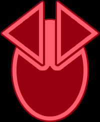

# Warfare Technologies (Red)

## Level 0
### Plasma Scoring
>When 1 or more of your units use Bombardment or Space Cannon, 1 of those units may roll 1 additional die.

### AI Development Algorithm
>When you research a unit upgrade technology, you may exhaust this card to ignore any 1 prerequisite.  
>When 1 or more of your units use Production, you may exhaust this card to reduce the combined cost of the produced units by the number of unit upgrade technologies that you own.

## Level 1
### Magen Defense Grid
>You may exhaust this card at the start of a round of ground combat on a planet that contains 1 or more of your units that have Planetary Shield; your opponent cannot make combat rolls this combat round.

### Magen Defense Grid Ω
>At the start of ground combat on a planet that contains 1 or more of your structures, you may produce 1 hit and assign it to 1 of your opponent's ground forces.

### Self Assembly Routines
>After 1 or more of your units use PRODUCTION, you may exhaust this card to place 1 mech from your reinforcements on a planet you control in that system.  
>After 1 of your mechs is destroyed, gain 1 trade good.

## Level 2
### Duranium Armor
>During each combat round, after you assign hits to your units, repair 1 of your damaged units that did not use Sustain Damage during this combat round.

## Level 3
### Assault Cannon
>At the start of a space combat in a system that contains 3 or more of your non-fighter ships, your opponent must destroy 1 of their non-fighter ships.
