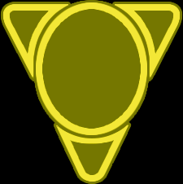

# Cybernetic Technologies (Yellow)

## Level 0
### Sarween Tools
> When 1 or more of your units use Production, reduce the combined cost of the produced units by 1Aerie Hololattice:

### Scanlink Drone Network
> When you activate a system, you may explore 1 planet in that system which contains 1 or more of your units.

## Level 1
### Graviton Laser System
> You may exhaust this card before 1 or more of your units uses Space Cannon; hits produced by those units must be assigned to non-fighter ships if able.

### Predictive Intelligence
>* At the end of your turn, you may exhaust this card to redistribute your command tokens  
>* When you cast votes during the agenda phase, you may cast 3 additional votes; if you do, and the outcome you voted for is not resolved, exhaust this card.

## Level 2
### Transit Diodes
> You may exhaust this card at the start of your turn during the action phase; remove up to 4 of your ground forces from the game board and place them on 1 or more planets you control.

## Level 3
### Integrated Economy
> After you gain control of a planet, you may produce any number of units on that planet that have a combined cost equal to or less than that planet’s resource value.
